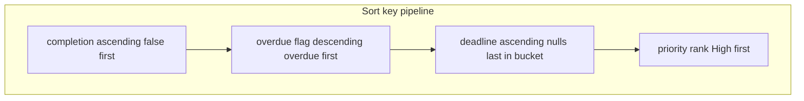

# Task Tracker Website

## Proposed Stack

*   **Vite + React + TypeScript** — SPA shell; same React patterns port to Expo/React Native, Tauri, Electron later.
*   **Supabase** — canonical remote store: Postgres + generated types optional, auth + realtime when you turn them on. Client: `@supabase/supabase-js`.
*   **Styling:** CSS modules or single App.css (Tailwind optional).

## Persistence Strategy (Single Codebase)

*   `TaskRepository` remains the only data surface for hooks/UI: list, upsert, remove; optional subscribe later (Supabase realtime).
*   **Runtime selection:** if `VITE_SUPABASE_URL` and `VITE_SUPABASE_ANON_KEY` are set, use `SupabaseTaskRepository`; otherwise `LocalTaskRepository` (localStorage). Same UI either way.
*   **v0 / first milestone:** implement `LocalTaskRepository` first if you want fastest UI without a project; then add Supabase adapter + migration in the same repo. Alternatively implement both adapters in one pass once the Supabase project exists.
*   **Row mapping:** DB columns `snake_case` (e.g., `estimated_time`, `real_time`); map to app `camelCase` inside repositories only.

## Supabase Schema (`tasks`)

| Column | Type | Notes |
| :--- | :--- | :--- |
| `id` | `uuid` (Primary Key) | default `gen_random_uuid()` |
| `user_id` | `uuid` (Nullable) | FK to `auth.users` when using auth; nullable for anonymous dev |
| `name` | `text` (Not Null) | |
| `estimated_time` | `double precision` (Not Null) | hours (or minutes — keep consistent with UI label) |
| `real_time` | `double precision` (Not Null) | default `0` |
| `deadline` | `date` (Nullable) | |
| `priority` | `text` | check in (`High`, `Medium`, `Low`) |
| `completion` | `boolean` (Not Null) | default `false` |
| `missed` | `boolean` (Not Null) | default `false`. Never updated by triggers from deadline |
| `updated_at` | `timestamptz` (Not Null) | default `now()`. Bump on every write |

*   Deliver a SQL migration file in-repo (e.g. `supabase/migrations/…sql`) with table + indexes (`user_id`, `deadline`, `completion`) and RLS: start with “allow all for authenticated user matching user_id” or permissive policy for solo dev; tighten before production.
*   **No DB trigger** that sets `missed` from past deadline.

## Data Model (App)

| Field | Type | Notes |
| :--- | :--- | :--- |
| `id` | `string` | UUID |
| `name` | `string` | required |
| `estimatedTime` | `number` | UI default: hours |
| `realTime` | `number` | same unit |
| `deadline` | `YYYY-MM-DD` \| `null` | date-only; compare using local calendar “start of today” |
| `priority` | `'High'` \| `'Medium'` \| `'Low'` | |
| `completion` | `boolean` | |
| `missed` | `boolean` | Manual only — overdue styling does not set this |
| `updatedAt` | `string` | ISO datetime |

## Allocations & Availabilities Architecture

To easily manage assigning tasks to specific dates based on a user's availability, the system uses a separate junction structure (`task_allocations`) rather than embedding `allocated_task_ids` inside an `Availability` record.

### Data Model

*   **Availability:** Defines available time windows for specific dates. (e.g. `id`, `date`, `startTime`, `endTime`).
*   **TaskAllocation:** Represents hours of a task assigned to a specific date. (e.g. `id`, `taskId`, `date`, `allocatedHours`).

### Two-Way Mapping (O(1) Lookups)

The application maintains two in-memory maps for O(1) lookups:
1.  **`tasksByDate`**: `Map<dateString, Record<taskId, allocatedHours>>` — Useful for rendering daily calendars or checking daily capacity.
2.  **`datesByTask`**: `Map<taskId, Record<dateString, allocatedHours>>` — Useful for displaying on a task row how many hours are allocated and when.

A function `setAllocation(taskId, date, hours)` maintains these mappings by creating or updating `TaskAllocation` records in the backend (Supabase or LocalStorage) and refreshing the local state.

## Overdue Rules (Display + Sort, Not Data)

*   **Overdue means:** `completion === false` AND `deadline != null` AND `deadline` (as a calendar date) is before today’s date in the user’s local timezone.
*   **Visual:** overdue rows (or at least Deadline cell) get a distinct style (e.g. accent border, background tint, “Past due” badge). Do not toggle `missed` automatically.
*   **Sort precedence (among incomplete tasks):**
    1.  Overdue first (“highest priority” in list order), then the rest.
    2.  Within overdue: sort by `deadline` ascending (earliest / longest-past first).
    3.  Within not-overdue incomplete: sort by `deadline` ascending (soonest first); tasks without a deadline after all tasks that have a deadline.
    4.  Then tie-break by priority `High` → `Medium` → `Low`.
    5.  Completed tasks remain last (e.g. by `deadline` then `priority`, or `updatedAt`; pick one stable rule).

*   Implement as a single comparator or multi-key stable sort in `sortTasks` (`src/lib/sortTasks.ts`) with tests or commented examples for edge cases (same day, null deadline, completed).

## Readonly Column: Cumulative Estimated Time by Deadline

*   **Header (example):** “Cumulative est.” (tooltip: sum of incomplete tasks’ estimated time through this calendar deadline).
*   **Computation:**
    1.  Take all tasks with `completion === false` and `deadline != null`.
    2.  Sort by `deadline` ascending, then stable tie-break (e.g. `id`).
    3.  Prefix sum of `estimatedTime` along that ordering.
    4.  Build a map `taskId` → cumulative sum at that task’s position.
*   **Display:** for each table row, show the mapped number readonly; for completed tasks or missing deadline, show `—` (empty).
*   **Note:** the number is defined by deadline calendar order, not by the main table’s visual row order, so two tasks with the same deadline receive different values if their stable sub-order differs (running sum advances row-by-row).

## UI / UX

### Table View (Main)

*   **Columns:** Task Name, Estimated time, Real time, Deadline, Priority, Completion, Missed, Cumulative est. (readonly).
*   **Inline edit:** all editable columns as before (not the cumulative column).
*   **Modal:** click task name (or explicit Edit control) → full edit; Save/Cancel.

### Add Task

*   Same as before: Task Name, Estimated time, Deadline, Priority; defaults for `realTime`, `completion`, `missed`, `updatedAt`.

### Accessibility

*   Modal `role="dialog"`, `aria-label`, focus management; overdue state not color-only (icon or text in addition to color).

## File / Module Layout

*   `src/types/task.ts` — types, priority rank, `isOverdue(task, nowDate)`.
*   `src/lib/sortTasks.ts` — comparator matching rules above.
*   `src/lib/cumulativeEstimatedByDeadline.ts` — pure function: `tasks → Map<id, number>`.
*   `src/data/taskRepository.ts` — interface.
*   `src/data/localTaskRepository.ts` — localStorage.
*   `src/data/supabaseTaskRepository.ts` — map rows ↔ tasks; uses Supabase client.
*   `src/lib/supabaseClient.ts` — createClient from env (export null if unset).
*   `src/hooks/useTasks.ts` — pick repo, state, CRUD.
*   `src/components/TaskTable.tsx` — cumulative column + overdue styles.
*   `src/components/TaskModal.tsx`
*   `src/App.tsx`
*   `supabase/migrations/*.sql` — schema + RLS starter.

## Verification (Manual)

*   Overdue incomplete task: styled, sorts above non-overdue incomplete, missed unchanged unless user checks it.
*   Cumulative column matches hand-calculated prefix sum for a few deadlines; completed / no-deadline show `—`.
*   With Supabase env: create/edit/delete round-trip; without env: localStorage persists.

## Out of Scope (Unless Requested Later)

*   Offline queue / optimistic conflict UI beyond `updated_at`.
*   Auto-setting Missed from calendar.
*   Mobile app shell (Expo) — types/repos stay reusable.
